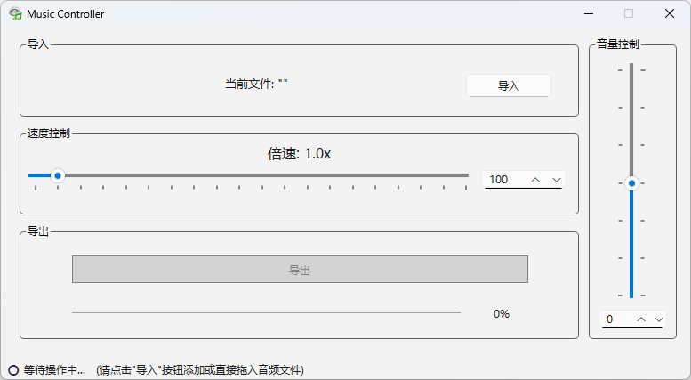

# Music Controller

### [English](README.md)  | 中文

🌍 可在 Windows10/11 操作系统中运行。

本项目使用了 [FFmpeg](https://www.ffmpeg.org/) 作为音频处理的核心库。

Music Controller 是一款音乐变速软件，可以调整音乐的播放速度和音量。通过简单的界面操作，你可以轻松地导入音乐文件，调整播放速度和音量，并将处理后的音乐导出到指定目录。

## 特性

- **调整播放速度**：通过滑块或输入框设置倍速播放。
- **调整音量**：通过滑块或输入框设置音量。
- **导入音乐文件**：支持拖放文件或使用“导入”按钮选择音乐文件。
- **导出处理后的文件**：选择导出目录保存处理后的音频文件。

## 开始

### 1. 安装

1. 从[Releases](https://github.com/YF-Eternal/Music-Controller/releases)中下载最新版安装包或便携包。

### 2. 使用

#### 导入音乐文件

- **拖入文件**：将音乐文件拖到软件窗口中。
- **点击导入**：点击“导入”按钮，选择你想处理的音乐文件。

#### 调整设置

- **播放速度**：通过滑块或输入框调整音乐的播放速度。
- **音量**：通过滑块或输入框调整音量。

#### 导出文件

1. 点击“导出”按钮。
2. 选择导出目录和文件名。
3. 软件将处理音乐文件，并将其保存到指定位置。
