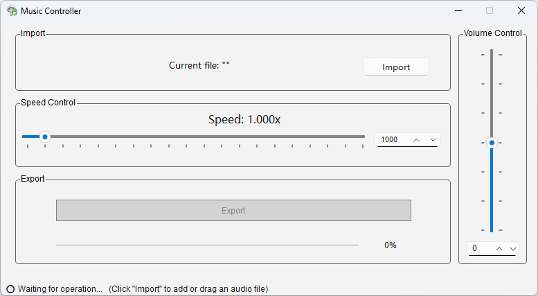

# Music Controller

### English  | [中文](README-CN.md)

🌍 Runs on Windows 10/11.

Music Controller is a music tempo adjustment software that allows you to adjust the playback speed and volume of your music. With a simple interface, you can easily import music files, adjust playback speed and volume, and export the processed music to a specified directory.

## Features

- **Adjust Playback Speed**: Set the playback speed using a slider or input box.
- **Adjust Volume**: Set the volume using a slider or input box.
- **Import Music Files**: Supports drag-and-drop or using the "Import" button to select music files.
- **Export Processed Files**: Choose an export directory to save the processed audio files.

## Getting Started

### 1. Installation

1. Download the latest installer or portable package from the [Releases](https://github.com/YF-Eternal/Music-Controller/releases).

### 2. Usage

#### Import Music Files

- **Drag and Drop**: Drag music files into the software window.
- **Click Import**: Click the "Import" button to select the music file you want to process.

#### Adjust Settings

- **Playback Speed**: Adjust the music playback speed using the slider or input box.
- **Volume**: Adjust the volume using the slider or input box.

#### Export Files

1. Click the "Export" button.
2. Choose the export directory and file name.
3. The software will process the music file and save it to the specified location.
